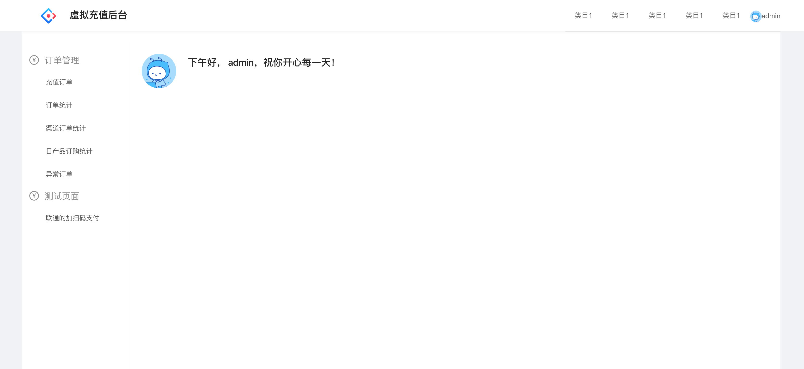

## 何时使用


使用umi框架时候，引用全局布局，

## API

必填参数 `logo`,`currentUser`,`collapsed`,`menuData`,

回掉函数`resetPassword` 示例：⚠️不设置默认请求`/password/reset`

```

resetPassword = (data,hide)=>{
  alert(JSON.stringify(data)); //这里拿到表单数据
  hide() //这里是隐藏掉modal的方法，如果页面跳转，可以不需要隐藏，如果是后续都是ajax操作，应该隐藏掉modal
  ...  //可以继续请求等后续操作
}


....
<WLayout
  ...
  resetPassword={this.resetPassword} //设置回掉方法
  ...
/>
```


`currentUser` 示例：

```
currentUser={{
  avatar:"https://gw.alipayobjects.com/zos/rmsportal/BiazfanxmamNRoxxVxka.png",
  name:window.user.username,
  notifyCount:0,
  userid:"00000001",
}}

```

### 用法：


```
<WLayout
  {...this.props}
  logo={require("../assets/logo.svg")}
  currentUser={{
    avatar:"https://gw.alipayobjects.com/zos/rmsportal/BiazfanxmamNRoxxVxka.png",
    name:window.user.username,
    notifyCount:0,
    userid:"00000001",
  }}
  collapsed={true}
  menuData={window.menus}
/>
```


新增一个参数`isNeedResetPassword`，强制显示修改密码不可关闭          --2018-12-27
